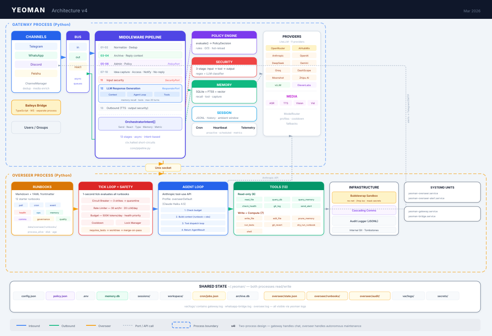

<div align="center">
  

  <h3>Policy-first personal AI assistant runtime</h3>

  <p>
    
    
    
    <a href="#channels"></a>
  </p>
</div>

---

**yeoman** is a lightweight, multi-channel AI assistant runtime with deterministic policy control, long-term memory, voice I/O, and tool sandboxing.

> Originally inspired by [HKUDS/nanobot](https://github.com/HKUDS/nanobot). MIT license preserved.

## Highlights

| | |
|---|---|
| **Policy engine** | Deterministic per-channel, per-chat access control with hot-reload — no ad-hoc ACLs |
| **Multi-channel** | Telegram, WhatsApp (Baileys bridge), Discord, Feishu — unified pipeline |
| **Durable processing** | Journal → threads/turns → effect outbox → transport receipts → reconciliation: every send is either provable or explicitly unresolved, never guessed |
| **Shared memory** | Source-bound facts with an audience, permission decided *before* retrieval, revocation that bumps a permission epoch |
| **Memory** | SQLite-backed semantic + FTS recall with session context and background notes |
| **Voice** | STT via Groq Whisper, TTS via ElevenLabs / OpenRouter — bidirectional voice in WhatsApp |
| **Tools & skills** | Sandboxed execution (bubblewrap), extensible skill system (OpenClaw-compatible) |
| **11 LLM providers** | OpenRouter, Anthropic, OpenAI, DeepSeek, Gemini, Groq, DashScope, Moonshot, Zhipu, AiHubMix, local vLLM — via LiteLLM |

## Architecture

```
Channel → Bus (inbound) → 13-stage Middleware Pipeline → OrchestratorIntent[]
  01 Normalize → 02 Dedup → 03 Archive → 04 Context → 05 Admin
  → 06 Policy → 07 Idea Capture → 08 Access Control → 09 New Chat
  → 10 No-Reply → 11 Security → 12 LLM Response → 13 Outbound
Intent dispatch → Bus (outbound/reaction) → Channel → User
```

Hexagonal / ports-and-adapters. `core/ports.py` defines interfaces (`PolicyPort`, `ResponderPort`, `ReplyArchivePort`, `SecurityPort`, `TelemetryPort`); adapters implement them. The pipeline emits typed `OrchestratorIntent` objects; channels react asynchronously. Media (ASR/TTS/vision) is cross-cutting — channels enrich inbound, the responder synthesizes outbound.

On top of that pipeline sits the **stateful processing line** added by the phase work
(01–06). It is opt-in per chat and inert by default:

```
inbound event
   │
   ├─ fast gate ── deny ──▶ archived, journaled, dropped (no model call)
   │                 │
   │              allow / shadow
   ▼                 ▼
canonical journal ─▶ join rules ─▶ thread + turn (revision, authority)
 (event_id,           (bundle,          │
  event_key,           follow-up,       ▼
  payload_hash,        new thread)   actor: freeze snapshot ▶ generate ▶ commit
  revision)                              │
                                         ▼
                                   effect outbox (CAS state machine)
                                         │
                  budget gate ───────────┤ (hard chat budget, waiting-outbox cap)
                                         ▼
                                   managed dispatch ─▶ transport
                                         │                 │
                                         ▼                 ▼
                                 transport receipt   provider message id
                                         │
                                         ▼
                          reconciler: probe, escalate, or confirm
```

<p align="center">
  
</p>

## Stateful message processing (Phases 01–06)

Everything below is disabled unless a chat is explicitly activated
(`processing.enabled` + `processing.chats`); `memory.shared.*` is a second, separate opt-in.
Non-activated chats keep the legacy path byte-for-byte.

### 01 · Journal and lineage

Every inbound event is canonicalised before any expensive work: `event_id`, deterministic
`event_key`, `trace_id`, `payload_hash`, channel/chat/principal, and its relation to the
parent event. Payloads are hashed, so dedup and lineage survive payload removal. The journal
is the single source of truth for *what happened*; effects and facts point back into it.

### 02 · Migration and egress control

Every mutating path is classified as **migrated** (routes through the effect gateway for a
managed chat), **blocked** (refused at runtime), or **legacy** (untouched, therefore refused
for a managed chat). Capabilities without an idempotency contract (`a2a_delegate`, `exec`,
`browse`, `calendar`) are disabled for activated chats, and a legacy producer cannot publish
into a managed chat unless it carries valid effect provenance.

### 03 · Threads, turns and cancellation

A join rule decides whether an event **starts a thread**, **bundles** into the open turn, or
**continues** a thread as a follow-up. Each turn carries a principal, a revision and a
context version; the actor freezes a snapshot before generation, so an effect always belongs
to the turn and revision that produced it. A correction during a provider call bumps the
revision and cancels the stale effects instead of letting a later turn silently authorise
them.

### 04 · Effect outbox, receipts and reconciliation

Effects move through a compare-and-set state machine:

| State | Meaning |
|---|---|
| `planned` · `queued` · `executing` | admitted, waiting, claimed by a worker |
| `sent` | **proven**: the transport returned, or a probe/receipt confirmed it |
| `blocked` · `expired` · `cancelled` · `failed` | refused with a reason, timed out, superseded, or provably not executed |
| `unknown` | dispatched but unproven — *not* a failure verdict |
| `unknown_nonrepeatable` | deadline passed; never silently downgraded to `failed` |

`sent` waits for nothing but the transport: read and delivery receipts are additional
evidence and can never downgrade a state. A claimed effect lost to a crash recovers to
`unknown` with a scheduled probe — never back to `queued`. The reconciler probes with
backoff (5 s → 600 s, six probes, 600 s deadline by default) and never re-executes the
original effect; a late receipt still corrects `unknown_nonrepeatable` to `sent`.

The WhatsApp bridge speaks **protocol v4**: edit, delete, reaction and receipt signals plus
`lookup_message` are journaled as first-class events.

### 05 · Shared memory: facts with an author and an audience

A shared fact is a memory node with provenance (`memory2_facts`, `memory2_fact_sources`), an
audience (`memory2_fact_principals`) and a lifecycle. Two rules define it:

- **Permission is a candidate filter, not a post-filter.** The reader is bound into the SQL
  `WHERE` clause, so a forbidden fact is never retrieved, ranked, embedded or rendered. A
  recheck against the current rows runs again immediately before output, and every rights
  change bumps `acl_epoch`, so no cached decision outlives it.
- **Facts fail closed.** The audience is the *intersection* of the sources' proven
  participants — never a union — and unknown membership means no injection. New group
  members inherit nothing; assistant text, summaries and private-handoff content are never
  sources.

Extraction is a bounded, source-versioned background job (one model call per settled turn,
at most four candidates, bounded queue) triggered by turn quiescence (60 s idle, 300 s cap).
The model only *proposes*: a deterministic screen refuses opinions, speculation, inferences,
delivery claims, meta-statements ("the author says …") and unresolved relative time. Facts
are stored with an embedding so they are findable by meaning, and a failing embedding
provider never loses the fact. Corrections and deletions invalidate derived facts
idempotently and redact text, FTS rows and vectors — while naming the copies they do *not*
purge.

Facts can be backfilled from archived history; the command is dry-run by default (one model
call per batch) and marks historical sources `archive:<message_id>` so they stay
distinguishable from live-turn facts:

```bash
yeoman memory facts backfill --chat <chat-id> --since 2026-08-11 --batch-size 20
yeoman memory facts backfill --chat <chat-id> --since 2026-08-11 --apply
```

### 06 · Budgets, integration and staged rollout

Sends are budgeted per chat with a **sliding, persisted, attempt-idempotent** reservation:
capacity returns 60 s after each individual send rather than at a minute boundary, the same
attempt never spends twice, a genuinely new attempt counts again, and a restart does not hand
capacity back. A soft per-thread limit is measured by default and enforced only when
`processing.budgets.threadSoftEnforce` is set — without a re-queue worker a refusal would
drop a reply instead of delaying it.

The rollout order is in the runbook: introduce the mode **disabled**, then **shadowed**
(journal and decide, but never send), then activate one chat, then consider shared memory.
Rollback is a configuration change: it stops new admissions, leaves claims and unresolved
effects intact, and deletes neither a database nor an archive.

### Data, schemas and retention — as they actually are

| Store | Schema | Notes |
|---|---|---|
| `data/processing/processing.db` | **5** | events, relations, threads, turns, generations, effects, attempts, evidence, receipts, probes, budget reservations |
| `data/memory/memory.db` | **2** | legacy nodes and embeddings, plus facts, sources, principals and extraction jobs |
| `data/inbound/reply_context.db` | — | inbound archive, **kept complete**: nothing is purged, and messages refused by the fast gate are recorded too |

Two honest limits: **journal payload retention is implemented but not scheduled**, so event
and effect payloads currently persist despite the configured windows; and a revocation cannot
reach SQLite backups, the archive, session-state files, or anything a model provider already
received. Both are stated in the runbook rather than implied away.

### Operating it

```bash
yeoman status                                 # config, policy, workspace, providers
yeoman channels whatsapp bridge status
systemctl --user show yeoman-gateway -p MainPID -p NRestarts -p ActiveState
yeoman logs | grep -E "protocol v|processing mode|thread_assigned|effect blocked"
yeoman memory facts list --limit 20           # shared facts: metadata only
yeoman memory facts jobs --state queued       # extraction backlog
```

See [`docs/architecture/processing-rollout-runbook.md`](docs/architecture/processing-rollout-runbook.md)
for the full procedure: current state, disabled introduction, admission stop, status query,
**WAL-safe backup** (never `cp` a live SQLite file), restart, bridge/IPC checks and rollback.

## Install

```bash
# Developer mode: source checkout + pinned repo venv
git clone https://github.com/dimitree2k/yeoman.git
cd yeoman
uv sync
./bin/yeoman --version

# User mode: installed CLI outside a source checkout
uv tool install yeoman
yeoman --version

# Or:
pip install yeoman
yeoman --version
```

Rule of thumb:

- If you are inside the yeoman git checkout, use `./bin/yeoman`
- If you installed yeoman as a tool or package, use `yeoman`
- Avoid `python3 -m yeoman.cli.commands` unless `yeoman env` shows that `python3` is the same interpreter backing the active launcher

Check the active runtime any time:

```bash
yeoman env
# or, in the repo checkout:
./bin/yeoman env
```

## Quick Start

**1. Initialize**

```bash
yeoman onboard
```

If you are working from the source checkout, run the same commands with `./bin/yeoman` instead.

**2. Add API keys** — pick any method:

| Method | Location | Notes |
|--------|----------|-------|
| `.env` file | `~/.yeoman/.env` | Recommended. `yeoman config migrate-to-env` can generate it |
| Environment variables | Shell / systemd | `OPENROUTER_API_KEY`, `ANTHROPIC_API_KEY`, etc. |
| Config file | `~/.yeoman/config.json` | Works but `.env` is preferred for secrets |

```bash
# Example: set model in config, key in .env
echo 'OPENROUTER_API_KEY=sk-or-v1-xxx' >> ~/.yeoman/.env
```

```json
{
  "agents": {
    "defaults": { "model": "anthropic/claude-opus-4-5" }
  }
}
```

**3. Chat**

```bash
yeoman agent -m "Hello!"
```

> [!TIP]
> For local models, point `providers.vllm.apiBase` at any OpenAI-compatible server (vLLM, Ollama, etc).

<a id="channels"></a>
## Channels

All channels are configured in `~/.yeoman/config.json` and access-controlled via `~/.yeoman/policy.json`.

| Channel | Complexity | Notes |
|---------|-----------|-------|
| **Telegram** | Easy | Bot token from @BotFather |
| **Discord** | Easy | Bot token + MESSAGE CONTENT intent |
| **WhatsApp** | Medium | QR link via `yeoman channels login` (Node.js ≥18) |
| **Feishu** | Medium | WebSocket — no public IP needed |

Start all enabled channels:

```bash
yeoman gateway
```

<details>
<summary><strong>Channel setup details</strong></summary>

### Telegram

```json
{ "channels": { "telegram": { "enabled": true, "token": "YOUR_BOT_TOKEN" } } }
```

### Discord

```json
{ "channels": { "discord": { "enabled": true, "token": "YOUR_BOT_TOKEN" } } }
```

Invite with scopes: `bot` · Permissions: `Send Messages`, `Read Message History`.

### WhatsApp

```bash
yeoman channels login   # scan QR
yeoman gateway           # start
```

```json
{ "channels": { "whatsapp": { "enabled": true } } }
```

Supports voice (STT + TTS), bridge lifecycle management (`yeoman channels bridge start|stop|restart|status`), and media persistence. The bridge speaks **protocol v4**: besides messages it reports edits, deletions, reactions and receipts, and answers `lookup_message` from its cache. A gateway that expects a different protocol refuses to start rather than talking past the bridge (`bridge.manifest.json` is validated against `PROTOCOL_VERSION`).

### Feishu

```bash
pip install yeoman[feishu]
```

```json
{
  "channels": {
    "feishu": { "enabled": true, "appId": "cli_xxx", "appSecret": "xxx" }
  }
}
```

</details>

## Policy Engine

`~/.yeoman/policy.json` controls four dimensions per channel and chat:

| Dimension | Modes |
|-----------|-------|
| **Who can talk** | `everyone` · `allowlist` · `owner_only` |
| **When to reply** | `all` · `off` · `mention_only` · `allowed_senders` · `owner_only` |
| **Allowed tools** | `all` · `allowlist` (with deny overrides) |
| **Persona** | Per-chat persona file selection |

Merge precedence: `defaults` → `channels.<ch>.default` → `channels.<ch>.chats.<id>`

Policy is hot-reloaded — no restart needed. Debug with:

```bash
yeoman policy explain --channel telegram --chat -1001234567890 --sender "12345|User"
```

Owner response controls (WhatsApp owner only):

```text
/stop              # pause current chat until /start
/stop all          # pause every chat until /start all
/start             # resume current chat
/start all         # resume all chats
/pause 30min       # pause current chat for a duration
/pause all 1h      # pause all chats for a duration
```

Supported pause units: `s`, `min`, `h`, `d` (for example `45s`, `15min`, `2h`, `1d`).

## Providers

| Provider | Type | |
|----------|------|--|
| OpenRouter | LLM gateway | [openrouter.ai](https://openrouter.ai) |
| AiHubMix | LLM gateway | [aihubmix.com](https://aihubmix.com) |
| Anthropic | LLM (Claude) | [console.anthropic.com](https://console.anthropic.com) |
| OpenAI | LLM (GPT) | [platform.openai.com](https://platform.openai.com) |
| DeepSeek | LLM | [platform.deepseek.com](https://platform.deepseek.com) |
| Gemini | LLM | [aistudio.google.com](https://aistudio.google.com) |
| Groq | LLM + STT (Whisper) | [console.groq.com](https://console.groq.com) |
| DashScope | LLM (Qwen) | [dashscope.console.aliyun.com](https://dashscope.console.aliyun.com) |
| Moonshot | LLM (Kimi) | [platform.moonshot.cn](https://platform.moonshot.cn) |
| Zhipu AI | LLM (GLM) | [open.bigmodel.cn](https://open.bigmodel.cn) |
| vLLM | Local LLM | Any OpenAI-compatible server |

Adding a new provider requires only 2 changes: a `ProviderSpec` in `providers/registry.py` and a config field in `config/schema.py`.

## Security

| Feature | Description |
|---------|-------------|
| **Policy engine** | Deterministic access control — no ad-hoc ACLs |
| **Workspace restriction** | `tools.restrictToWorkspace: true` sandboxes all file/exec tools |
| **Exec isolation** | Linux bubblewrap sandboxing with per-session containers |
| **Scoped file grants** | Explicit path grants with blocked paths/patterns override |
| **I/O validation** | Three-stage security middleware: input → tool → output checks with sensitive data redaction |

## Overseer

The **overseer** is an autonomous orchestration layer that runs alongside the gateway. It executes **runbooks** — declarative maintenance scripts that monitor health, clean up resources, prune memory, audit policy, and sample response quality.

```bash
yeoman overseer start              # start the service
yeoman overseer status             # check PID, heartbeat, budget
yeoman overseer runbooks           # list loaded runbooks
yeoman logs                        # tail all logs (gateway + bridge + overseer)
```

Runbooks are Markdown files with YAML frontmatter. Two modes:

- **Deterministic** — check a condition, send an alert. No LLM, no cost.
- **LLM-escalated** — spin up a Claude agent with scoped tools and a token budget, sandboxed via bubblewrap.

Safety is layered: circuit breakers, rate limits (30 actions/hr, 20 LLM calls/day), budget caps (500K tokens/day), cooldowns, lock management, and network-isolated sandboxing.

12 starter runbooks ship out of the box (health checks, log rotation, memory pruning, policy audit, and more). See [`packages/overseer/README.md`](packages/overseer/README.md) for full documentation.

For persistent operation:

```bash
yeoman overseer install-units
systemctl --user daemon-reload
systemctl --user enable --now yeoman-overseer
```

## Health Check

If yeoman includes the bundled `agent-doctor` skill, you can run a local health check for memory,
cron, config, workspace files, gateway/bridge, security posture, and system prerequisites.

Ask the agent:

```text
diagnose yeoman
run a health check
check what is broken
```

Or run it directly:

```bash
yeoman doctor
```

If runtime behavior seems inconsistent, inspect the active launcher and Python first:

```bash
yeoman env
```

Use it:

- right after onboarding
- after editing `config.json`, `.env`, or `policy.json`
- after runtime/dependency upgrades
- when memory, gateway, WhatsApp, or cron behavior seems off

Exit codes:

- `0` no problems found
- `1` warnings or critical issues found

The doctor does not auto-fix anything; it reports findings and proposed fixes first.

For the stateful processing line, check these directly:

```bash
systemctl --user show yeoman-gateway -p ActiveState -p NRestarts -p MainPID
yeoman logs | grep -E "protocol v|processing mode|thread_assigned|assignment_unavailable|effect blocked"
yeoman memory facts jobs --state queued     # extraction backlog
```

A gateway start that exits with status 0 is the single-instance guard, not a crash; a start
that exits 1 with "Bridge manifest protocol mismatch" means bridge and gateway disagree about
the protocol version.

## CLI Reference

| Command | Description |
|---------|-------------|
| `yeoman onboard` | Initialize config & workspace |
| `yeoman agent -m "..."` | Single-shot chat |
| `yeoman agent` | Interactive chat |
| `yeoman gateway` | Start all enabled channels |
| `yeoman status` | Runtime status |
| `yeoman env` | Show active launcher and Python environment |
| `yeoman doctor` | Run health checks and report issues |
| `yeoman logs` | View gateway/bridge/overseer logs |
| **Channels** | |
| `yeoman channels login` | Link WhatsApp (scan QR) |
| `yeoman channels status` | Show channel status |
| `yeoman channels bridge start\|stop\|restart\|status` | Manage WhatsApp bridge |
| **Policy** | |
| `yeoman policy path` | Show policy file location |
| `yeoman policy explain` | Debug policy decisions for a chat/sender |
| `yeoman policy cmd "/policy ..."` | Run policy commands from CLI |
| `yeoman policy annotate-whatsapp-comments` | Auto-fill WhatsApp group names in policy |
| **Memory** | |
| `yeoman memory status` | Memory backend info and counters |
| `yeoman memory search --query "..."` | Search long-term memory |
| `yeoman memory add --text "..."` | Insert manual memory entry |
| `yeoman memory prune` | Retention cleanup |
| `yeoman memory reindex` | Rebuild FTS index |
| `yeoman memory notes status\|set` | Per-chat background notes config |
| **Shared facts** (admin) | |
| `yeoman memory facts list` | List facts as metadata only — no raw text of other principals |
| `yeoman memory facts show <id> [--content]` | One fact: status, audience, sources |
| `yeoman memory facts revoke <id>…` | Tombstone, redact text/FTS/vector, bump the permission epoch |
| `yeoman memory facts supersede <id> --by <ref>` | Mark a fact superseded by a replacement |
| `yeoman memory facts jobs [--state queued]` | Extraction backlog and skip reasons |
| `yeoman memory facts backfill --chat <id> --since <date>` | Extract facts from history — **dry-run** unless `--apply` |
| **Config** | |
| `yeoman config migrate-to-env` | Move secrets from config.json to .env |
| **Overseer** | |
| `yeoman overseer start [--foreground]` | Start the overseer service |
| `yeoman overseer stop` | Stop the overseer service |
| `yeoman overseer status` | PID, heartbeat, budget snapshot |
| `yeoman overseer runbooks` | List loaded runbooks |
| `yeoman overseer install-units` | Install systemd user units |
| **Cron** | |
| `yeoman cron list\|add\|remove\|enable\|run` | Manage scheduled tasks |
| `yeoman cron add-voice` | Schedule voice broadcast jobs |

## Configuration Reference

### `processing.*` — the stateful mode

| Key | Default | Meaning |
|---|---|---|
| `enabled` | `false` | master switch; `false` keeps the chat on the legacy path |
| `chats` | `[]` | activated chats, `whatsapp:<chat-id>` |
| `shadowChats` | `[]` | journal and decide, never send |
| `dbPath` | `data/processing/processing.db` | journal, threads, effects, receipts, probes |
| `budgets.chatHardUnits` / `chatHardWindowSeconds` | `6` / `60` | hard per-chat send budget (sliding) |
| `budgets.threadSoftUnits` / `threadSoftWindowSeconds` | `2` / `10` | soft per-thread limit |
| `budgets.threadSoftEnforce` | `false` | enforce the soft limit as a refusal (needs the re-queue worker) |
| `budgets.outboxWaitingPerChat` | `20` | waiting-outbox cap; overflow blocks visibly |
| `extraction.idleSeconds` / `maxDelaySeconds` | `60` / `300` | when a turn counts as settled |
| `reconciliation.backoffSeconds` | `[5,15,45,120,300,600]` | probe schedule for `unknown` effects |
| `reconciliation.maxProbes` / `deadlineSeconds` | `6` / `600` | escalation to `unknown_nonrepeatable` |
| `reconciliation.claimLeaseSeconds` | `30` | a crashed claim recovers as `unknown` after this |
| `reconciliation.providerLookupEnabled` | `false` | provider lookups stay off (no proven contract) |
| `reconciliation.clientMessageId` | `false` | echo a client message id (off until the bridge proves idempotency) |
| `retention.journalPayloadDays` / `lineageMetadataDays` / `unresolvedDays` / `sharedFactDays` | `7` / `30` / `90` / `90` | configured windows — see the retention caveat above |

### `memory.shared.*` — shared facts

| Key | Default | Meaning |
|---|---|---|
| `enabled` | `false` | read path plus runtime; needs `memory.enabled` and `processing.enabled` |
| `extractionEnabled` | `false` | the extraction worker; without it no fact is ever created |
| `extractorVersion` | `shared-facts-v1` | stamped on every fact and part of the job key |
| `maxJobsWaiting` | `64` | queue cap; overflow is `skipped/queue_full`, never silent |
| `requireKnownMembership` | `true` | unknown membership injects nothing |

Config keys are camelCase in `config.json` and snake_case in the Pydantic schema; the loader
converts. `Config` keeps `extra="ignore"`, so an existing config file keeps loading.

## Testing & Quality

```bash
uv run pytest -q                    # full Python suite
uv run ruff check .                 # lint
git diff --check                    # whitespace / conflict markers
cd packages/bridge && npm run build && npm test   # bridge (TypeScript, node --test)
```

The suite isolates itself from live state: `tests/conftest.py` points `YEOMAN_HOME` at a
throwaway directory, so a test that forgets to pin a database path cannot open the runtime
tree. Tests live in `tests/gateway`, `tests/shared` and `tests/overseer`; new files under the
ignored `tests/gateway/*` need a matching `!tests/gateway/<file>` entry in `.gitignore`.

## Documentation

| Document | Contents |
|---|---|
| [`docs/architecture/processing-rollout-runbook.md`](docs/architecture/processing-rollout-runbook.md) | staged rollout, admission stop, WAL-safe backup, rollback, deletion limits |
| [`packages/overseer/README.md`](packages/overseer/README.md) | overseer runbooks, triggers, safety rails |
| [`CHANGELOG.md`](CHANGELOG.md) | release history |

The phased design notes and their evidence lists (plans 01–06, per-task acceptance records)
are kept as private working documents outside this repository.

## Docker

```bash
docker build -t yeoman .
docker run -v ~/.yeoman:/root/.yeoman -p 18790:18790 yeoman gateway
```

## Project Structure

```
packages/
├── gateway/      Main gateway service
│   └── yeoman_gateway/
│       ├── agent/        Core agent loop, prompt builder, skills, tools
│       ├── core/         Orchestrator pipeline, ports, intents, models
│       ├── adapters/     Port implementations (policy, LLM, archive, telemetry)
│       ├── channels/     Telegram, WhatsApp, Discord, Feishu
│       ├── providers/    LLM registry, LiteLLM wrapper, transcription
│       ├── policy/       Engine, schema, identity normalization, personas
│       ├── processing/   Journal, threads/turns, actor, effect outbox, dispatch,
│       │                 budgets, receipts, reconciliation, timings
│       ├── memory/       SQLite store, embeddings, extractor, sessions,
│       │                 shared facts, read gate, extraction jobs, archive backfill
│       ├── media/        ASR, TTS, vision, routing
│       ├── security/     Rule engine, bubblewrap isolation
│       ├── skills/       Bundled skills (github, weather, cron, tmux...)
│       └── cli/          typer commands
├── overseer/     Autonomous orchestration layer
│   └── yeoman_overseer/
│       ├── agent/        LLM agent loop, budget tracker, tool dispatch
│       ├── runbook/      Schema, parser, starter runbooks
│       ├── trigger/      Evaluator, health checks (poll/cron/event)
│       ├── safety/       Circuit breaker, rate limiter
│       ├── audit/        JSONL logger, internal git
│       ├── comms/        Cascading alerts (Telegram, SMTP)
│       └── systemd/      Service unit files
├── shared/       Shared config schema, utilities
└── bridge/       WhatsApp bridge (TypeScript / Baileys)
```

## Changelog

See [CHANGELOG.md](CHANGELOG.md) for full release history.

---

<sub>MIT License · Originally inspired by [HKUDS/nanobot](https://github.com/HKUDS/nanobot)</sub>
