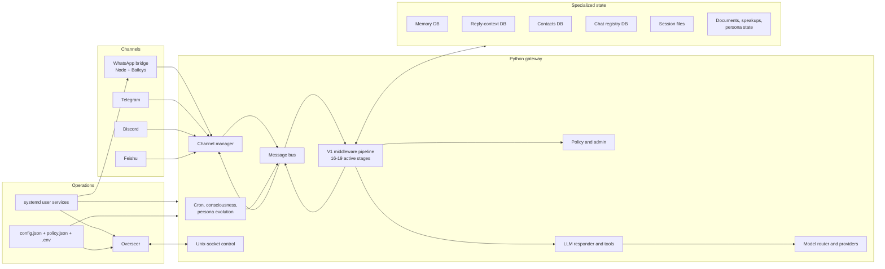
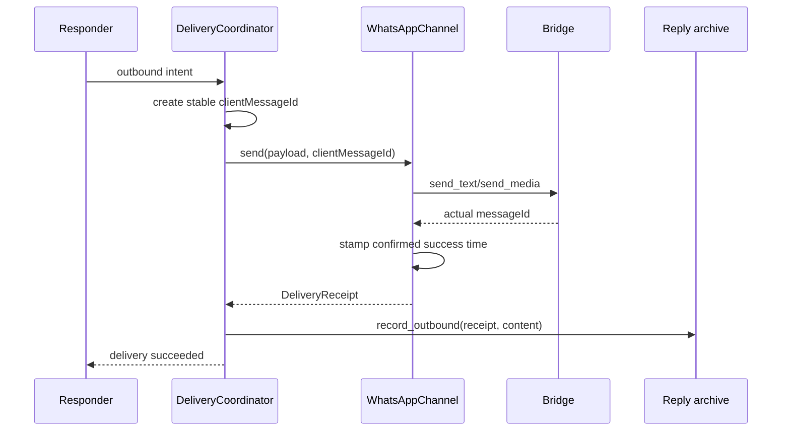

# Yeoman architecture audit

Date: 2026-08-15

Scope: `/home/dm/Documents/yeoman` (source) and `/home/dm/.yeoman` (live runtime)

Mode: read-only architecture and runtime audit; no runtime behavior was changed

## Executive conclusion

Yeoman has a viable core architecture. The small middleware engine, explicit policy stage, channel adapters, specialized SQLite stores, bridge process boundary, and systemd sandboxing are all reasonable choices for a personal always-on assistant. The current V1 path should remain the product core.

The largest risks are not a missing orchestration framework. They are contracts around the core that have drifted or are only partly wired:

1. The WhatsApp bridge log contains raw Signal session records emitted by a transitive dependency. Those records include sensitive cryptographic state and must be treated as secret material.
2. The active chat-registry SQLite database fails integrity checks on two indexes.
3. Six enabled, deterministic Overseer runbooks contain no parseable actions but are still recorded as successful triggers. One of them, `health-gateway`, also tests the healthy state rather than the failure state.
4. The source tree's normal targeted tests pass, but the repository does not provide a trustworthy clean-clone gate: many tests are ignored/untracked, the full suite has collection errors, mypy has known failures, and GitHub has no CI test workflow.
5. Configuration loading is also configuration writing. Multiple long-running processes may persist migrations/defaults, which creates an ownership race. Runtime sockets and hard-coded `~/.yeoman` paths add further contract drift.
6. The bridge already supports deterministic outbound message IDs and real send receipts, but the Python WhatsApp channel does not use them. A retry after an uncertain result can duplicate a message, and successful outbound messages are not durable reply anchors.

The right strategy is **repair and simplify before extending**. Contain the data risks, establish truthful health/test contracts, complete outbound delivery semantics, and then split only the two proven responsibility knots (`EnginePolicyAdapter` and `LLMResponder`). Do not reintroduce a parallel turn engine, generic dependency-injection container, new event mesh, or another chat-history database.

## Snapshot and limitations

- All three live user services were active during the audit: gateway, bridge, and Overseer.
- The bridge listened on `127.0.0.1:3001`. The gateway exposed `/home/dm/.yeoman/run/gateway.sock`; Overseer exposed `/home/dm/.yeoman/var/run/overseer.sock`. Nothing listened on TCP port 18790.
- The gateway runs from editable Python installs whose source is `/home/dm/Documents/yeoman`, but the process started on 2026-08-01. Source edits made after that start are not active until restart.
- The bridge runs the deployed cache at `/home/dm/.yeoman/var/cache/bridge/dist/index.js`. Its JavaScript matches the current built source; declaration files are present only in the source build.
- The source worktree was already dirty: 50 status entries and a tracked diff of 43 files, 2,497 insertions, and 186 deletions. This audit evaluates that exact working tree. It does not assume uncommitted work is ready to ship.
- Runtime configuration and logs were inspected without reproducing credentials, chat contents, identifiers, or cryptographic values in this note.
- Findings about implementation size are estimates, not project commitments.

## Current architecture

The effective pipeline is not the documented 13-stage pipeline. It contains 16 mandatory stages plus up to three optional approval/contact stages:

1. normalization
2. deduplication
3. inbound archive
4. contacts enrichment (optional)
5. reply context
6. admin command routing
7. policy
8. implicit addressing
9. reply budget
10. speak-up approval (optional)
11. persona-evolution approval (optional)
12. workflow approval (optional)
13. idea capture
14. access control
15. new-chat notification
16. no-reply filter
17. input security
18. responder
19. outbound preparation

This ordering is a useful explicit policy. The problem is not the count itself; it is that documentation and integration tests do not make the ordering a maintained contract.

## Layer scorecard

| Layer | Assessment | Main reason |
|---|---|---|
| Repository/runtime separation | Mixed | Correct conceptual split, but dirty deploy state and runtime artifacts are easy to commit |
| Service/process topology | Good | Clear systemd isolation and a useful Node/Python boundary |
| Channel layer | Mixed | WhatsApp is capable and tested; other advertised channels have weak contract coverage |
| Message bus | Mixed | Simple and bounded, but counters are wrong and dormant IPC/event paths add noise |
| Middleware pipeline | Good | Small, legible, deterministic V1 core; ordering documentation is stale |
| Policy/admin | Fragile | Rich capability model, but one 2,735-line adapter owns unrelated operations |
| Responder/tools | Fragile | Feature-complete but 2,462 lines and 32 constructor arguments form a responsibility knot |
| Provider/model routing | Mixed | Central registry is good; LiteLLM globals and error-as-content are unsafe boundaries |
| Memory/session/reply state | Mixed | Specialized stores fit their lifecycles; migrations, backups, and health are fragmented |
| Consciousness/persona layers | Mixed | Approval and policy gates are thoughtful; coupling and operational state increase complexity |
| Overseer/automation | Fragile | Strong sandbox/circuit-breaker ideas, but deterministic no-op runbooks report success |
| Security | Mixed | Strong exec/systemd isolation; critical cryptographic log disclosure and private backup risk |
| Observability | Fragile | Logs exist, but metrics are ephemeral, log ownership is split, and status paths disagree |
| Tests/quality gates | Fragile | Large passing local suite, but no reliable clean-clone/full-suite/CI contract |
| Packaging/container | Fragile | Editable source works live; Docker contract and dependency declarations have drifted |
| Documentation | Fragile | Several central diagrams, paths, protocol versions, and stage counts are stale |

## Prioritized findings

### P0 — contain sensitive bridge logs

**Evidence**

- Recent `/home/dm/.yeoman/var/logs/whatsapp-bridge.log` output contains raw libsignal session-record objects.
- `packages/bridge/node_modules/libsignal/src/session_record.js:273` calls `console.info("Closing session:", session)`.
- The bridge's pino logger is silent, but pino cannot suppress a dependency's direct `console.info`.
- systemd appends bridge stdout and stderr to the persistent file.

**Impact**

The log contains private ratchet/session material. Anyone or any backup with access to that log has more than ordinary diagnostic data. The exact values must never enter Git, support messages, reports, or model context.

**Recommendation**

1. Stop the emission at process/dependency boundary: upgrade to a dependency version without the log, patch the dependency reproducibly, or install a narrowly scoped redaction/suppression hook before libsignal loads.
2. Add a bridge test that fails if session-record objects reach stdout/stderr.
3. After the fix is active, securely retire or tightly quarantine contaminated bridge logs and any backups that contain them. Decide the retention method before deletion.
4. Keep bridge operational logs structured and metadata-only. Never log message bodies, auth state, session records, or raw model payloads.

### P1 — repair the live chat-registry indexes

**Evidence**

Read-only `PRAGMA quick_check` and `PRAGMA integrity_check` on `/home/dm/.yeoman/data/inbound/chat_registry.db` reported:

- wrong entry count in `idx_chats_first_seen`
- wrong entry count in `sqlite_autoindex_chats_1`
- a row missing from both indexes

The table had 28 rows at the snapshot. The active WAL was about 4.1 MB. All other checked active databases returned `ok`.

**Impact**

Primary-key lookup can miss a row or admit incorrect behavior, and first-seen ordering can be wrong. Because the registry drives chat discovery and targeting, an index error can become an identity/routing error.

**Recommendation**

1. Plan a controlled gateway stop or maintenance window.
2. Take a consistent SQLite backup using the backup API, not a filesystem copy of only the main DB.
3. Run integrity checks on the backup, rebuild the affected indexes or restore from a known-good source, and re-run checks.
4. Add `yeoman doctor storage` checks for every active DB and WAL-aware backups. Do not automatically mutate a live database from a health check.

### P1 — deterministic Overseer runbooks can succeed while doing nothing

**Evidence**

Six enabled `escalate_to_llm=false` runbooks parsed to zero deterministic actions:

- `comms-daily-digest`
- `health-disk`
- `health-gateway`
- `ops-log-rotation`
- `ops-media-cleanup`
- `ops-session-cleanup`

`parse_deterministic_actions()` returns an empty list for prose/non-YAML action sections. `_on_runbook_triggered()` then falls through and writes an audit entry with `action="triggered"` and `result="success"`. The evaluator records circuit-breaker success.

`health-gateway` also uses a `process_alive == true` condition, so its semantic trigger is the healthy state. Its PID-file target does not represent the systemd-managed gateway process in the current runtime.

**Impact**

Operational dashboards and audit trails claim maintenance ran when no action occurred. The gateway health runbook cannot reliably detect the current service failure mode.

**Recommendation**

- Validate every enabled runbook at load time.
- An enabled deterministic runbook with zero parseable actions must be disabled with a loud error or fail startup validation.
- Use a `systemd_active == false` check for systemd-owned services instead of a legacy PID file.
- Use systemd/journald retention for service logs. A rename-based application rotator cannot safely rotate an append target held open by systemd.
- Add a repository test that parses every starter runbook and every synced runtime runbook.

### P1 — source tests are not a reproducible quality gate

**Evidence**

- `uv run pytest -q tests/gateway/ tests/shared/ tests/overseer/`: **868 passed**.
- `npm test` in `packages/bridge`: build succeeded and **23 passed**.
- `uv run ruff check .`: **passed**.
- Targeted mypy over gateway core/adapters: **14 errors**.
- `uv run pytest -q tests/`: **19 collection errors**, mostly imports from the retired `yeoman.*` namespace.
- 95 Python/TypeScript test files are tracked, 125 exist on disk, and 27 ignored/untracked Python test files exist.
- `.gitignore` ignores `tests/*` and allowlists individual tests. Several active tests can therefore pass locally but disappear from a clean clone.
- `.github/workflows` contains release/assistant workflows but no test/lint/type/build CI gate.

**Impact**

The local result is encouraging but not reproducible. A clean checkout can have less coverage, and merges/releases can proceed with collection or type failures.

**Recommendation**

1. Stop ignoring the test tree. Ignore fixtures/artifacts explicitly, not test source files.
2. Classify the 30 on-disk-only test files: track current tests, port valuable legacy tests, delete obsolete ones.
3. Define one supported default suite and make `pytest tests/` collect cleanly.
4. Add CI for the supported Python suite, ruff, mypy (with an explicit initial baseline if necessary), bridge tests/build, and a Docker build only if Docker remains supported.
5. Keep complexity checks advisory and focused on named hotspots; do not mass-refactor every function over an arbitrary threshold.

### P1 — outbound delivery lacks idempotency and durable receipts

**Evidence**

- Bridge protocol v3 accepts `clientMessageId` for text, media, polls, and reactions.
- The bridge passes that ID to Baileys and returns the actual `messageId` in its send result.
- Python `WhatsAppChannel.send()` neither supplies `clientMessageId` nor consumes the returned receipt.
- `_send_command_with_retry()` retries timeout/connection/internal errors with the same payload but no deterministic send ID.
- `InboundArchive` only provides `record_inbound`; reply-context lookup cannot anchor a delayed reply to a successful Yeoman outbound message.
- A complete design and plan already exist under `docs/superpowers/` for extending the existing reply archive rather than adding a new store.

**Impact**

An uncertain first send can be repeated. Delayed explicit replies can lose their authoritative outbound anchor and be interpreted using newer ambient conversation.

**Recommendation: implement a small Outbound Delivery Receipt slice**

- Derive a deterministic, protocol-valid `clientMessageId` once per outbound intent and reuse it across retries.
- Return a typed send receipt from the channel (`channel`, `chat_id`, message ID, timestamp, kind).
- After confirmed success, call `record_outbound()` on the existing reply-context DB with `direction=outbound`.
- Keep inbound-only range/history consumers inbound-only; allow exact reply lookup and the reply window to read both directions.
- For multi-media sends, record each platform message separately; attach the caption only to the message that actually carried it.
- Archive failure must not fail an already successful WhatsApp send, but must emit a clear health signal.

This should be one cohesive feature slice, not a new delivery framework or database.

### P1 — configuration has multiple implicit writers

**Evidence**

`load_config()` validates/migrates configuration and writes a backup plus a normalized `config.json` whenever the loaded JSON differs from the serialized model. Gateway, CLI, and Overseer all load shared configuration. Historical runtime work already observed an older Overseer process re-persisting removed keys after a gateway-side cleanup.

The filesystem contract is also inconsistent:

- shared helpers define `YEOMAN_HOME/var/run`
- gateway currently serves `YEOMAN_HOME/run/gateway.sock`
- Overseer serves `YEOMAN_HOME/var/run/overseer.sock`
- schema defaults put both sockets in `~/.yeoman/run`
- 47 source references contain literal/default `~/.yeoman` paths, and several code paths bypass the shared helpers entirely

**Impact**

A read can mutate live configuration. An old process can revive removed defaults. Alternate `YEOMAN_HOME`, container, test, and recovery environments behave inconsistently. Health checks can inspect the wrong socket/PID path.

**Recommendation: establish single-writer configuration ownership**

- Make ordinary load pure and read-only.
- Move schema migration/default persistence to explicit `yeoman config migrate` and config-edit commands.
- If daemon writes remain necessary, use a file lock plus schema/version compare-and-swap and identify the writer in an audit record.
- Route all runtime roots through `yeoman_shared.utils.helpers` (or a passed runtime-path object).
- Choose `YEOMAN_HOME/var/run` as the canonical ephemeral socket/PID directory; provide a short compatibility transition for the current gateway socket.

### P2 — policy and responder adapters are responsibility knots

`EnginePolicyAdapter` is 2,735 lines. It evaluates/reloads policy, persists response pauses, dispatches admin commands, approves/denies work, handles panic shutdown, resets/forgets sessions, changes voice settings, sends voice, and discovers bridge groups. The command classes near the bottom are mostly thin delegates back to this adapter.

`LLMResponder` is 2,462 lines with 32 constructor arguments. It owns the model/tool loop, session persistence, memory recall/capture, contacts, target resolution, private handoff, pending delivery, text/voice delivery, social holdback, cooldowns, provider selection, and tracing.

**Recommendation**

- Move admin-command behavior into the command handlers or a small `PolicyAdminService`; leave `EnginePolicyAdapter` responsible for policy evaluation, translation, and reload.
- Extract one `DeliveryCoordinator` responsible for target resolution, private handoff, text/voice send, send receipts, and outbound archiving. Leave `LLMResponder` responsible for prompt/session/tool/model flow.
- Split `build_gateway_runtime()` into three or four plain builder functions (state services, agent services, automation services). Do not add a DI container, service locator, plugin framework, or abstract factory hierarchy.

### P2 — provider errors cross the user boundary as content

`LiteLLMProvider.chat()` catches every exception and returns `LLMResponse(content="Error calling LLM: ...", finish_reason="error")`. The responder path does not consistently stop on that finish reason. The bootstrap fallback also includes the raw exception in `Sorry, I encountered an error: {e}`.

The provider constructor mutates global LiteLLM retry/log settings and process environment. Per-instance API bases are correctly passed per call, but retry policy and credentials still have process-global coupling. Runtime logs also showed a LiteLLM async logging callback warning.

**Recommendation**

- Raise a typed, sanitized `ProviderError` internally.
- Return a generic user message plus a correlation ID; keep structured details in protected logs.
- Pass retry and callback behavior per call/client where LiteLLM supports it.
- Centralize credential environment setup once at bootstrap rather than in every provider instance.
- Add a test proving provider messages, endpoints, and exception text cannot become chat output.

### P2 — dormant HTTP/event architecture is neither product nor infrastructure

`api/server.py` provides a 365-line FastAPI control plane and `api/webhooks.py` adds 118 lines. No production entrypoint calls `create_app()` or `run_server()`. FastAPI and uvicorn are not declared/installed gateway dependencies. Webhooks are disabled with no configured sources. Most typed event classes and the unbounded `OverseerCommand` IPC queue are unused; only inbound observation events have active consumers.

**Recommendation**

Pick one explicit direction:

- **Preferred now:** delete the dormant HTTP server, webhook code, unused event classes, and unbounded IPC branch. Keep the Unix-socket control interface and the one active inbound-observation event.
- **Only if remote HTTP/webhooks are a near-term product requirement:** make them an explicit optional package/service with declared dependencies, authentication/threat model, lifecycle wiring, and integration tests.

Do not keep an unstartable server as architecture documentation.

### P2 — observability is present but not operationally coherent

- Production bootstrap always creates `InMemoryTelemetry`; counters disappear on restart and are not exported.
- Prometheus and SQLite telemetry adapters exist but are not wired into the live gateway. Prometheus dependencies are optional/absent.
- The dormant HTTP API contains the only metrics endpoint.
- `MessageBus._put_bounded()` increments `_outbound_dropped` for reaction overflow, leaving `_reaction_dropped` permanently inaccurate.
- `gateway.log` is stale while current gateway/Overseer logs use the user journal and the bridge uses an append file.
- A runtime snapshot script looks under `var/run` and therefore reports the active gateway socket/PID incorrectly.

**Recommendation**

- Fix the reaction counter and add queue-overflow tests for every queue.
- Expose current queue sizes/drop counters, last inbound/outbound success, DB health, and channel degradation through the existing Unix-socket `status` command.
- Choose journald as the service-log owner and configure retention there. Keep only product audit logs that need structured retention outside the journal.
- Delete unwired telemetry adapters, or wire one explicitly. For this single-host system, rich IPC status plus journald is sufficient until external monitoring is a real requirement.

### P2 — live deployment and container contracts drift

The editable Python installation points at source, but a long-running service does not reload source. The bridge correctly runs a copied cache, but the runtime retains 31 bridge cache backups. Current cache lacks `package.json`, which contributes to Node's module-type warning. Runtime also retains six large memory DB backups and several obsolete zero-byte database paths.

Docker is internally inconsistent:

- image user/HOME are `/home/yeoman`
- README mounts the runtime at `/root/.yeoman`
- Docker exposes 18790 even though the gateway uses a Unix socket and has no TCP listener
- default image command is `status`, while the README overrides it with `gateway`
- `.dockerignore` does not exclude `.venv`, `.worktrees`, or `.superpowers`; the local source tree is 1.3 GB, mostly development environments/worktrees

**Recommendation**

- Make restart-required versus deploy-required status explicit in `yeoman status` (source revision/process start/deployed bridge manifest).
- Add retention for bridge cache backups and memory migration backups.
- After validation and approval, remove zero-byte legacy DBs: `data/memory.db`, `data/inbound/archive.db`, `data/inbound/inbound.db`, and `data/inbound/contacts.db`.
- Either repair and CI-build the Docker contract or remove Docker instructions until supported. A misleading recovery path is worse than no advertised container path.
- Deploy bridge package metadata needed for ESM interpretation, or emit `.mjs` consistently.

### P2 — runtime Git contains a staged private-state archive

The runtime repository has a staged `backups/turn-engine-v2-20260726-205115/runtime-state.tgz`. Its listing includes chat/session JSONL, contacts/reply/memory databases, and bridge cache material. It did not list the secrets directory, but it still contains private conversations and identity/state data.

**Recommendation**

- Unstage and move runtime-state archives outside the Git worktree after confirming an approved encrypted backup destination.
- Add archive patterns and known backup directories to the runtime `.gitignore`.
- Treat the runtime repository as configuration/policy only. Persisted conversations, DBs, logs, media, auth state, and full runtime snapshots should never be Git candidates.
- If this archive was ever pushed, audit remote history and rotate/remediate according to the exposed data class.

### P2 — database evolution and backup are fragmented

Specialized databases are reasonable because their retention, access patterns, and privacy domains differ. The issue is that each class creates/alters its own schema without a common version/health inventory. WAL-aware backup and retention are not centralized.

**Recommendation**

Add a small storage registry used by `yeoman doctor storage`:

- logical store name
- resolved path
- expected schema/user version
- owner process
- backup policy
- integrity result and last successful check

Do not merge all state into one SQLite database and do not introduce an ORM solely for migrations. A few explicit migration functions plus `PRAGMA user_version` are sufficient.

### P3 — secondary channels are advertised beyond their evidence

WhatsApp has extensive tests and a real bridge lifecycle. Telegram has some coverage. Discord and Feishu have no equivalent contract tests and are disabled in the current runtime. `ChannelManager` can catch a channel startup error while leaving the gateway alive.

**Recommendation**

- Label Discord/Feishu experimental until each passes a shared channel contract test: start, receive normalization, send, reaction/unsupported behavior, health degradation, and stop.
- Surface channel startup failures as `degraded` in status and owner alerts.
- Remove an adapter if there is no real user/maintenance commitment; four nominal channels are not better than two trustworthy channels.

### P3 — architecture documentation has become historical narrative

README and architecture docs refer to a 13-stage pipeline, older package paths, protocol v2, old DB/log/auth paths, and bridge behavior inconsistent with `acceptFromMe=true`. The overview omits Overseer, consciousness/persona evolution, contacts, bridge deployment, Unix IPC, and the private runtime/source boundary.

**Recommendation**

- Establish `docs/architecture/overview.md` as the canonical current-state document.
- Generate or assert protocol version and middleware order in tests so docs cannot silently drift.
- Separate current state, accepted decisions, superseded designs, and implementation plans.
- Add a short operations matrix: component, source path, deployed path, process owner, state path, logs, restart/deploy command, and health signal.

## Layer-by-layer evaluation

### 1. Source/runtime boundary

**What works**

- Separating source from live policy/state is correct.
- Editable Python installs make source provenance inspectable.
- Bridge deployment via a cache avoids running directly from a working tree.
- systemd units provide explicit process ownership.

**What to improve**

- Make the boundary enforceable: source contains code/tests/docs; runtime contains config/policy/state but no Git-tracked private data.
- Record a source revision and bridge manifest in status.
- Avoid ambiguous legacy paths (`run` versus `var/run`, `media` versus `var/media`).
- A service being active is not proof it loaded the current source/config; status should show PID start time and loaded revision/config generation.

### 2. Process and service topology

**What works**

- Node/Baileys is isolated from the Python assistant process.
- systemd units use non-root execution, `ProtectSystem=strict`, `PrivateTmp`, `NoNewPrivileges`, bounded memory, and restart policy.
- Bridge-to-gateway reconnect behavior and protocol negotiation are explicit.

**What to improve**

- Add dependency/readiness semantics rather than only `After=network.target`.
- Distinguish alive, connected, authenticated, and protocol-compatible health.
- Make the bridge's file-log choice consistent with systemd log management.
- Validate deployed bridge manifest/protocol before restart, then verify reconnect from the live gateway.

### 3. Channel adapters and normalization

**What works**

- Channel-specific metadata is normalized before policy/responder processing.
- WhatsApp handles media, mentions, quoting, presence, reconnect, protocol validation, and path validation.
- The bridge command schema is typed and tested.

**What to improve**

- `whatsapp.py` (1,667 lines) and `whatsapp.ts` (1,841 lines) deserve internal cohesive helpers, but only around stable seams: connection lifecycle, media enrichment, outbound command building, and receipt handling.
- Use a shared `DeliveryReceipt` contract without forcing every channel to support WhatsApp-specific semantics.
- Surface degraded channel startup and delivery failure through status.
- Honor `YEOMAN_HOME` for Telegram/Discord media paths.

### 4. Message bus and events

**What works**

- A local `asyncio.Queue` bus is the right scale for one gateway process.
- Bounded queues with drop-oldest behavior prevent unbounded memory growth.
- Inbound observation events decouple consciousness timing from response generation.

**What to improve**

- Fix reaction drop accounting.
- Replace the 50 ms polling event dispatcher with a blocking wait or one active queue.
- Delete unused event/IPC types rather than preserving a speculative event backbone.
- Document delivery guarantees: in-memory, at-most-process-lifetime, drop-oldest under pressure.

### 5. Middleware pipeline

**What works**

- The pipeline engine itself is small and easy to reason about.
- Ordering makes policy, security, reply context, approvals, and outbound preparation visible.
- V1 measured materially faster and more reliable than the removed V2 planner experiment.

**What to improve**

- Add one architecture test for the default and optional layer order.
- Give middleware a short declared contract: inputs added, stop conditions, intents produced, side effects.
- Keep side effects close to named stages. Avoid moving pipeline decisions into the responder.
- Use per-stage timing already available in telemetry to identify real latency before adding planning stages.

### 6. Policy and admin

**What works**

- Policy is evaluated before model generation and can enforce capability boundaries.
- Effective-policy tooling enables exact chat/sender verification.
- Admin commands are separated from ordinary prompts in the pipeline.

**What to improve**

- Reduce `EnginePolicyAdapter` to the `PolicyPort` responsibility.
- Put mutations behind explicit services with audit records and tests.
- Use one group/contact resolver shared by admin, responder, and outbound delivery.
- Avoid thin command classes that only delegate back into a giant adapter.

### 7. Responder, tools, and delivery

**What works**

- The tool loop, session context, model routing, memory, voice, and social controls are integrated and extensively tested.
- Reply budgets and social holdback directly address observed group behavior.
- Tool policy and execution isolation are stronger than typical personal-agent projects.

**What to improve**

- Separate reasoning/model flow from delivery/target resolution.
- Treat tool/provider failures as typed control flow, not generated chat content.
- Cap trace payloads and keep full provider/tool data out of logs.
- Preserve quoted-message precedence over ambient context at the delivery/archive boundary.

### 8. Provider/model layer

**What works**

- Provider registry centralizes model/provider metadata.
- Routes separate chat, embeddings, transcription, vision, and other workloads.
- Per-call API base avoids the worst global LiteLLM endpoint leak.

**What to improve**

- Remove remaining global retry/environment coupling.
- Define error, timeout, cancellation, retry, and token-usage semantics on the provider port.
- Keep routing configuration small: 34 profiles, 19 routes, and 13 providers are manageable only with validation for unused/shadowed entries.
- Add a config report showing which profiles/routes are reachable from enabled features.

### 9. Memory, sessions, contacts, and reply context

**What works**

- Separate stores match distinct retention and query models.
- Reply context, contacts, session history, memory, and document cache are not forced into one schema.
- Current checked databases, except chat registry, passed read-only integrity checks.

**What to improve**

- Add schema versions, integrity inventory, WAL-aware backup, and retention ownership.
- Complete outbound reply anchors in the existing reply DB.
- Remove confirmed legacy empty paths after a controlled inventory.
- Reduce duplicate/stale migration backups once a verified encrypted backup exists.

### 10. Consciousness and persona evolution

**What works**

- Speak-up and persona changes pass through approval/policy gates.
- Inbound observation is decoupled from direct reply generation.
- State has dedicated storage and safety tests.

**What to improve**

- Keep these features optional and isolated from the mandatory chat path.
- Require clear status signals for queue backlog, last evaluation, last approval, and failure.
- Avoid another general scheduler/event system; reuse the current bus/cron paths only where their guarantees fit.
- Review privacy/logging separately because these layers inspect broad conversation context.

### 11. Overseer

**What works**

- Runbooks, sandboxing, rate limits, circuit breakers, locks, maintenance windows, and audit entries are sound primitives.
- The bridge watchdog and stale-agent cleanup have real deterministic actions.
- Overseer is a separate process with stronger systemd hardening.

**What to improve**

- Make parseability/action validation a load-time invariant.
- Replace PID-file assumptions with systemd-aware checks.
- Do not count “triggered” as “successful action.” Track `triggered`, `no_action`, `succeeded`, `failed`, and `escalated` distinctly.
- Prefer native service/log retention facilities before adding deterministic actions.

### 12. Security and privacy

**What works**

- Exec host execution is disabled; bubblewrap is enabled, workspace-restricted, and fail-closed.
- Input and tool security are enabled.
- Secret/config files have restrictive modes, and the home directory is not traversable by other users.
- systemd hardening is meaningful.

**What to improve**

- Treat the bridge log leak and staged runtime archive as urgent data incidents.
- Make chat IDs and memory extractor payloads debug-only/redacted; default service logs to privacy-safe INFO.
- Current output security is disabled and strict profile is false. Document this as an accepted posture or enable appropriate output controls; do not leave it implicit.
- Add a secret/privacy scan that covers runtime Git candidates and logs without printing matched values.

### 13. Observability and operations

**What works**

- Services expose enough local state to diagnose PIDs, sockets, bridge connectivity, and protocol.
- Structured audit records exist for policy/Overseer workflows.
- Targeted stage telemetry exists in code.

**What to improve**

- Consolidate status around current systemd/PID/socket/connection/config-generation evidence.
- Ensure counters are correct and exposed.
- Define which logs live in journald versus product audit stores.
- Health checks must not silently mutate config or databases.

### 14. Tests and maintainability

**What works**

- 868 Python tests and 23 bridge tests passing is a substantial safety net.
- Ruff passes over the current source.
- High-risk WhatsApp, policy, responder, security, and consciousness behavior has meaningful coverage.

**What to improve**

- Restore a clean-clone/full-suite contract before trusting the count.
- Fix or baseline the 14 mypy errors in the two largest adapters.
- Add CI and artifact-free test discovery.
- Use complexity results only to choose seams. Current hotspots include `build_gateway_runtime` (complexity 82), WhatsApp media enrichment (39), responder generation (36), and policy group logic (30).

### 15. Packaging and dependencies

**What works**

- The Python packages have a recognizable gateway/shared/Overseer split.
- The bridge has a lockfile and typed protocol.

**What to improve**

- Audit direct declarations that appear redundant or transitive (`aiohttp`, `websocket-client`, `requests`, `lxml`, `lxml-html-clean`; `socksio` is already supplied through HTTPX SOCKS support). Verify imports/features before removal.
- Keep optional integrations in explicit extras if they are not part of the default gateway.
- Exclude `.venv`, `.worktrees`, `.superpowers`, and other development state from Docker context.
- Avoid calling the package layout hexagonal while adapters/pipeline import broad concrete feature modules. The useful goal is stable seams, not architectural-label purity.

## Recommended additions and changes

### Build now: Outbound Delivery Receipt and Archive

This is the clearest new cohesive capability. It closes two user-visible correctness gaps with infrastructure that mostly exists already.

Acceptance criteria:

- retries reuse the same client ID
- receipt uses the actual platform ID when supplied
- successful send is not reversed by archive failure
- archive records outbound direction without changing inbound history readers
- delayed quoted reply resolves to the exact outbound anchor
- multi-media, voice, reply, reaction-only, timeout, reconnect, and archive-failure tests exist

### Build now: Runbook Validator

This should be a validator function/CLI check, not a daemon or schema framework.

It should reject:

- enabled deterministic runbook with zero actions
- unknown action name
- missing target
- invalid check/operator/value combination
- service health checks that trigger on the healthy value unless explicitly declared informational
- cron runbook with no executable LLM or deterministic path

Run it during starter-runbook tests, runtime sync, and `yeoman doctor`.

### Build next: explicit Config Migration Guard

This is primarily a behavior change, not a new subsystem:

- pure `load_config`
- explicit migrate command
- schema version and backup
- atomic write plus lock/CAS for commands that edit config
- writer/revision in audit output

### Extract next: DeliveryCoordinator

Only extract after the outbound receipt behavior is specified by tests. Its responsibilities should be limited to target resolution, private handoff/pending delivery, channel send, voice selection, receipt handling, and outbound archive. It should not own prompting, memory extraction, policy decisions, or channel connection lifecycle.

### Do not build now

- another turn-planning engine or parallel V2 path
- a generic workflow engine for ordinary replies
- a dependency-injection container/service locator
- a general cross-process event mesh
- a new outbound-message database
- a monolithic database/ORM migration
- always-on HTTP control plane without a concrete external consumer
- an abstraction for every provider/channel before a second implementation needs it

## Remediation roadmap

### Phase 0 — contain and recover (immediate)

1. Stop sensitive libsignal session logging.
2. Quarantine/retire contaminated logs and affected backups after the emission is fixed.
3. Unstage and relocate the private runtime archive.
4. Repair chat-registry indexes from a consistent backup during a controlled stop.
5. Verify all active SQLite stores after restart.

Exit condition: no sensitive session material is newly logged; runtime Git has no private-state archive candidate; every active DB passes integrity checks.

### Phase 1 — make evidence truthful

1. Validate all runbooks and correct `health-gateway` semantics.
2. Fix queue drop counters.
3. Track the intended tests; remove/port obsolete ignored tests.
4. Make the supported full suite collect and add CI.
5. Add storage, channel, loaded-config generation, and deployed-revision status.

Exit condition: health/audit state corresponds to executed work and a clean checkout reproduces the passing gate.

### Phase 2 — close delivery and ownership contracts

1. Implement deterministic outbound IDs, receipts, and outbound reply archiving.
2. Make config loading pure and choose a single writer.
3. Canonicalize `YEOMAN_HOME/var/run` and shared runtime paths.
4. Establish backup retention and WAL-aware procedures.

Exit condition: uncertain sends are idempotent, delayed quoted replies resolve correctly, and no daemon silently rewrites config.

### Phase 3 — simplify proven hotspots

1. Extract `DeliveryCoordinator`.
2. Move admin behaviors out of `EnginePolicyAdapter`.
3. Split bootstrap into a few plain builder functions.
4. Delete or deliberately productize the dormant HTTP/event code.
5. Remove redundant direct dependencies and obsolete runtime artifacts.

Exit condition: responder/policy constructors and modules have clear ownership, with no new framework.

### Phase 4 — documentation and optional product work

1. Rewrite canonical current-state architecture and operations docs.
2. Add channel contract coverage before promoting Discord/Feishu.
3. Decide whether external Prometheus/HTTP/webhooks are actually required.
4. Only then consider new modules based on measured product need.

## Ponytail over-engineering audit

Ranked, deletion-first findings:

1. `packages/gateway/yeoman_gateway/core/message.py:1` — `delete:` remove the unused 244-line future unified `Message` model; current runtime uses `InboundEvent`/bus messages — `replacement:` existing message types.
2. `packages/gateway/yeoman_gateway/api/server.py:1` + `api/webhooks.py:1` — `delete:` remove the unwired 483-line FastAPI/webhook control plane — `replacement:` existing Unix-socket control, unless a funded HTTP consumer exists now.
3. `packages/gateway/yeoman_gateway/adapters/policy_engine.py:2452` — `shrink:` remove the long series of handlers that only delegate back to the giant adapter — `replacement:` a direct command map or handlers that own the behavior.
4. `packages/gateway/yeoman_gateway/bus/events.py:1` + `bus/queue.py:40` — `delete:` remove unused event types and the unbounded Overseer IPC branch — `replacement:` the active bounded inbound-observation queue and Unix socket.
5. `packages/gateway/yeoman_gateway/core/ports.py:53` — `delete:` remove the duplicate `TelemetryPort` and unused `RuntimeSupervisorPort` — `replacement:` shared telemetry protocol and direct lifecycle functions.
6. `packages/overseer/yeoman_overseer/executor/deterministic.py` — `native:` remove bespoke service-log rotation behavior — `replacement:` journald retention/logrotate with correct file-descriptor semantics.
7. `packages/gateway/pyproject.toml` — `dependency:` verify and remove unused/redundant direct declarations such as `aiohttp`, `websocket-client`, `requests`, `lxml`, and `lxml-html-clean` — `replacement:` already-used HTTPX/readability transitive stack.
8. `/home/dm/.yeoman/data` — `delete after validation:` remove four zero-byte legacy DB placeholders — `replacement:` canonical operational-data paths.
9. `/home/dm/.yeoman/var/cache` — `retention:` prune 31 bridge deployment backups after retaining a small verified rollback set — `replacement:` manifest-addressed releases with explicit retention.

`net: -1,000 lines, -5 direct dependencies possible` (conservative estimate; excludes generated files, tests, docs, and runtime data).

## Verification evidence

| Check | Result at audit snapshot |
|---|---|
| Gateway/shared/Overseer targeted tests | 868 passed in 53.31 s |
| Bridge build/tests | 23 passed |
| Ruff | passed |
| Targeted mypy (gateway core/adapters) | failed with 14 errors |
| Full `tests/` collection | failed with 19 collection errors |
| Config schema/load validation | valid; current migration reported no change |
| Memory DB quick check | ok |
| Reply-context DB quick check | ok |
| Contacts DB quick check | ok |
| Document-cache DB quick check | ok |
| Consciousness/speakups DB quick check | ok |
| Chat-registry DB integrity | failed on two indexes |
| Gateway service | active |
| WhatsApp bridge service | active, TCP 127.0.0.1:3001 |
| Overseer service | active |
| Gateway TCP 18790 | no listener; current control path is Unix socket |
| Bridge source build vs deployed JavaScript | matched; source-only declaration files differ |

## Evidence map

Primary implementation paths examined:

- `packages/gateway/yeoman_gateway/app/bootstrap.py`
- `packages/gateway/yeoman_gateway/core/orchestrator.py`
- `packages/gateway/yeoman_gateway/pipeline/`
- `packages/gateway/yeoman_gateway/adapters/policy_engine.py`
- `packages/gateway/yeoman_gateway/adapters/responder_llm.py`
- `packages/gateway/yeoman_gateway/channels/whatsapp.py`
- `packages/gateway/yeoman_gateway/providers/`
- `packages/gateway/yeoman_gateway/storage/`
- `packages/gateway/yeoman_gateway/memory/`
- `packages/gateway/yeoman_gateway/consciousness/`
- `packages/gateway/yeoman_gateway/persona_evolution.py`
- `packages/gateway/yeoman_gateway/bus/`
- `packages/gateway/yeoman_gateway/api/`
- `packages/shared/yeoman_shared/config/`
- `packages/shared/yeoman_shared/telemetry/`
- `packages/overseer/yeoman_overseer/`
- `packages/bridge/src/`
- `tests/`, `.github/`, Dockerfile, README, architecture docs, and current plans/specs

Runtime evidence examined:

- active systemd unit definitions/status/PIDs/listeners/sockets
- deployed bridge cache and manifest
- sanitized effective config posture and file permissions
- runtime Git status and archive member names
- current runbook metadata/action parseability
- database inventory, WAL presence, sizes, and read-only integrity checks
- recent service/bridge log structure (without copying sensitive values)

## Decision summary

Keep:

- the V1 middleware pipeline
- Node bridge/Python gateway process split
- systemd user-service model
- specialized SQLite stores
- explicit policy/security gates
- current reply-budget/social-control direction

Repair first:

- secret-bearing logs
- chat-registry integrity
- inert runbooks and health semantics
- clean-clone tests/CI
- outbound idempotency/receipts/archive
- config ownership and runtime path contract

Simplify next:

- policy/admin responsibility knot
- responder/delivery responsibility knot
- dormant HTTP/event code
- telemetry choices, backup sprawl, dependencies, and stale documentation

The architecture does not need a larger brain. It needs fewer ambiguous owners and stronger proof at process, delivery, state, and test boundaries.

## Provider, tool, media, and telemetry egress addendum

Date: 2026-08-16

The current tree does not have one authorization-aware egress boundary. A source scan found direct remote-client ownership in at least ten Python modules across Gateway tools, Discord, TTS, embeddings, provider/transcription adapters, Overseer Telegram alerts, and shared Langfuse tracing. Other model/media paths reach provider abstractions indirectly, so import count alone understates the disclosure surface.

Architecturally relevant findings:

- `providers/registry.py` describes provider naming, LiteLLM prefixes, endpoint defaults, detection, and parameter overrides, but not data classes, handling tags, processor identity, retention/training posture, jurisdiction, transform requirements, or disclosure authorization.
- `media/router.py` selects profiles by route/channel and runtime cooldown. Its fallback semantics are availability-driven, not a proof that every fallback is authorized for the exact materialized payload.
- Provider inference by model keyword, key prefix, arbitrary API base, or first available credential can silently change the data recipient. The replacement must resolve only strict, versioned profiles.
- Memory extraction/embedding, transcription, TTS, web/browse/market tools, channels, Overseer communications, and telemetry currently own network behavior in different places.
- `telemetry/tracing.py` can send inputs, outputs, metadata, identifiers, model parameters, and tool-related data to Langfuse independently of the future Trust decision flow. Merely leaving this dormant would violate the zero-stale-code release rule.
- Channel transport is a separate external boundary from model/tool egress: delivery authorization and current audience govern channel sends, while Controlled Egress governs processors and tool destinations.
- Overseer currently has model/network-capable code paths. In the target design Overseer must not call models; model-assisted operational analysis is an explicitly authorized supervised workload.

This evidence supports a hybrid target: trusted first-party, latency-bounded model/media calls use one in-Gateway Controlled Egress module; network-risky tools run as supervised, OS-constrained workers. It does not support claiming that the current tree already enforces that boundary.

## Execution-isolation addendum

Date: 2026-08-16

The current source contains useful Bubblewrap primitives, but not one trustworthy workload-isolation contract:

- Gateway shell sessions use a bespoke Bubblewrap builder with `--share-net`, a read-write workspace, broad read-only host runtime mounts, and the Yeoman service UID.
- The browser starter separately uses `--share-net`, broad device and `/sys` exposure, a detached localhost HTTP controller, and one shared persistent host profile containing browser cookies/session state.
- Overseer has a third Bubblewrap wrapper. It correctly uses `--unshare-net`, but exposes broad source/runtime trees and accepts arbitrary shell/test commands despite the target Overseer role being lifecycle reconciliation.
- The current host has `bwrap`; no Podman or Docker executable was found. Existing Docker packaging/documentation was already audited as drifted.
- Bubblewrap supplies namespaces and mounts, not a safe public-Internet-only network. The existing `--share-net` paths and pre-resolution URL checks cannot enforce the target SSRF/internal-network boundary.

The replacement must converge browser, shell/code execution, document conversion, untrusted parsing, web retrieval, and other risky executables on one fixed capsule launcher and immutable profile contract. Current wrappers are migration evidence, not reusable proof of release-ready containment.

## Retention and deletion addendum

Date: 2026-08-16

The current tree actively contradicts the approved indefinite raw-retention policy:

- reply-context history is hard-deleted after 30 days at startup and during normal writes;
- media configuration and cleanup paths delete canonical input after age limits or transformations, and an enabled runbook advertises 7-day incoming/3-day outgoing cleanup;
- an enabled Overseer memory runbook can directly copy and hard-delete SQLite rows by age/salience;
- `/forget` only toggles `is_deleted`, leaving plaintext and projections behind while presenting the action as forgetting;
- inbound enrichment can update stored message text instead of preserving raw and derived representations separately;
- stale docs/tests/config encode 7-day or 30-day canonical retention assumptions.

These are release blockers, not policy defaults to migrate. Historical data already deleted by them cannot be reconstructed and must be reported as a legacy provenance gap.

The replacement needs one canonical/noncanonical classification for every stored object. Raw message/media, identity/audience evidence, causal relationships, delivery/model/tool/workload effects, accepted transforms/results, canonical memory versions, and recovery/lifecycle receipts are canonical. Presence/typing/keepalive frames without causal effect, duplicate SDK/wire/debug copies, projections, caches, scratch, discarded browser resources, and routine reconcile chatter are not.

Current per-object encryption/provenance plans support future erasure design, but an old backup containing usable wrapped keys remains decryptable outside the supported restore workflow. The architecture must not claim adversarial or forensic cryptographic erasure across retained generations without a separate non-rollbackable key authority or verified destruction/rewrite of every affected generation.

## Failure, health, and release-scope addendum

Date: 2026-08-16

Current operations do not provide one truthful failure/recovery contract:

- channel outbound dispatch consumes in-memory work before send; errors are logged without a durable terminal/unknown result or reconciliation owner;
- bounded in-memory queues can discard work, so they cannot be delivery authority;
- health is split across simple process/channel booleans, bridge status, CLI checks, an unconditional HTTP `status=ok`, PID-file assumptions, and runbooks whose prose may parse to zero actions;
- zero-action deterministic runbooks can still record success and circuit-breaker success;
- configuration reads can rewrite the active file, silently fall back after invalid content, and allow stale processes to revive removed state;
- retry and external-effect-unknown ownership varies by channel/provider/tool;
- targeted tests are valuable, but clean-clone collection, type checks, packaging, artifact manifests, and CI are not a trustworthy release contract;
- WhatsApp and Telegram are live-enabled, but Telegram does not yet provide the target durable Edge/Delivery/Evidence semantics. Discord and Feishu are disabled executable paths without first-release proof;
- the current consciousness, autonomous speak-up, persona-evolution, generic-runbook, and dormant HTTP/event paths create extra autonomous mutation/retry surfaces in the mandatory runtime. The owner subsequently classified consciousness/speak-up as required product behavior and persona evolution as removable; therefore proactivity must be rebuilt behind the target Trust/Workload/Delivery contracts rather than copied or forgotten.

### Owner correction: required proactivity, no persona evolution

Date: 2026-08-16

Consciousness and speak-up cannot be treated as optional backlog. The live runtime currently enables scheduled, burst, and lull consciousness behavior, and the source implementation spans approximately 5,000 lines across the consciousness, speak-up approval, persona-evolution, and related CLI surfaces. The live consciousness ledger contained 2,323 proposal/decision rows at inspection time, including 326 sent speakups, plus 180 taste-distillation fingerprints. This is established product behavior and migration state, not a greenfield idea.

The architectural response is not to preserve that coupled subsystem. Rebuild consciousness/speak-up as a registered, leased, domain-scoped Proactivity Workload whose proposals pass through the same Trust, Action, Delivery, Evidence, retry, and unknown-effect contracts as reactive sends. Its historical state must be reconciled into canonical or explicitly restricted inert records before retirement. If the replacement follows the core cutover, the redesign remains incomplete until it is delivered; the deferral must be a named gated milestone, not a note in a future-work list.

The owner chose that sequence on 2026-08-16: reactive core cutover first, then mandatory Proactivity Phase 2 after the core stabilization gate. The planned gap is accepted; preserving the old executable path during it is not.

Persona evolution is removed as executable behavior. The live runtime currently has it enabled in `auto_apply` mode, with 102 historical scans and 11 proposals at inspection time. Preserve one reviewed static persona generation, migrate the old ledger/proposal artifacts into generic protected evidence to satisfy no-data-loss and traceability, and then delete every persona-evolution-specific runtime, schema, command, test, dependency, config key, schedule, and support claim.

These findings support additive scoped operational fences, typed reconcilers, durable effect states, and one authenticated local status snapshot. They do not support a global healthy boolean, generic workflow engine, Kubernetes-style resource platform, process-restart-as-recovery, or preserving disabled adapters “for flexibility.”
